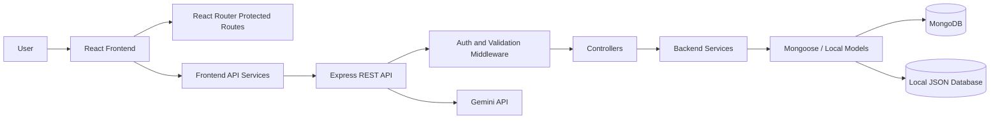

<h1 align="center">TaskFlow</h1>

<p align="center">
  A modern full-stack task management platform for organizing work, tracking progress, managing priorities, and improving productivity through a secure SaaS-style dashboard.
</p>

<p align="center">
  
  
  
  
  
</p>

---

## Table of Contents

- [Overview](#overview)
- [Problem Statement](#problem-statement)
- [Key Features](#key-features)
- [Tech Stack](#tech-stack)
- [Application Workflow](#application-workflow)
- [Architecture](#architecture)
- [Project Structure](#project-structure)
- [Installation and Setup](#installation-and-setup)
- [Environment Variables](#environment-variables)
- [API Endpoints](#api-endpoints)
- [Screenshots](#screenshots)
- [Edge Cases Covered](#edge-cases-covered)
- [Future Enhancements](#future-enhancements)
- [Project Highlights](#project-highlights)
- [Author](#author)

---

## Overview

TaskFlow is a full-stack task management application built with a React frontend and an Express.js backend. It enables users to register, log in securely, manage tasks, track priorities, monitor progress, and view productivity insights through a responsive dashboard.

The project is designed with a production-style structure. Frontend pages, reusable components, context providers, API services, backend routes, controllers, services, models, validation, and middleware are separated into clear modules. This makes the application easier to understand, maintain, and extend.

TaskFlow also includes a Gemini-powered workspace assistant that can help users reason about their tasks, summarize backlog, and plan work more effectively.

---

## Problem Statement

Task management systems often become difficult to use or maintain when they lack secure authentication, clean architecture, clear task visibility, and useful dashboard insights. Users need a single workspace where they can quickly understand what is pending, what is in progress, what is completed, and which work needs attention first.

TaskFlow solves this by providing:

- Secure authentication and protected routes
- Centralized task creation and management
- Search, sorting, filtering, and status tracking
- Dashboard analytics for task progress and priority distribution
- A responsive SaaS-style user interface
- RESTful APIs with validation and error handling
- MongoDB support with a local JSON database fallback
- AI-assisted workspace support using Gemini

---

## Key Features

### Authentication

- User registration
- User login
- Quick demo access
- JWT-based authentication
- Password hashing with bcrypt
- Protected frontend routes
- Token validation middleware
- Session persistence through local storage

### Task Management

- Create new tasks
- View all tasks
- View task details
- Edit task information
- Update task status
- Delete tasks
- Search tasks by text
- Filter tasks by status and priority
- Sort tasks by date and priority
- Manage task due dates

### Dashboard and Analytics

- Total task count
- Pending task count
- In-progress task count
- Completed task count
- Status distribution chart
- Priority distribution chart
- Recent task activity
- Workspace health and bottleneck analysis
- Productivity overview

### AI Workspace Assistant

- Gemini API integration
- Task-aware assistant responses
- Workspace summary support
- Productivity suggestions
- Graceful error handling when the API key is missing

### User Experience

- Responsive dashboard layout
- Dark and light theme support
- Sidebar navigation
- Toast notifications
- Loading states
- Empty states
- Form validation feedback
- Modern SaaS visual design

### Developer Features

- Modular frontend architecture
- Modular backend architecture
- Express route/controller/service pattern
- Joi request validation
- Centralized API response format
- Centralized error handling
- MongoDB with Mongoose
- Persistent local JSON database fallback
- TypeScript-powered Vite entry
- Production build with esbuild
- VS Code Chrome debugging configuration

---

## Tech Stack

| Layer | Technology |
| --- | --- |
| Frontend | React 19, Vite, Tailwind CSS |
| Routing | React Router |
| UI Icons | Lucide React |
| Charts | Recharts |
| Animation | Motion |
| Backend | Node.js, Express.js |
| Database | MongoDB |
| ODM | Mongoose |
| Local Fallback | Persistent JSON files |
| Authentication | JWT, bcryptjs |
| Validation | Joi |
| AI Integration | Google Gemini API |
| Security | Helmet, CORS |
| Logging | Morgan |
| Build Tools | TypeScript, tsx, esbuild |

---

## Application Workflow

1. User registers a new account or uses Quick Demo Access.
2. Backend validates credentials and generates a JWT token.
3. Frontend stores the session and protects authenticated routes.
4. User enters the dashboard workspace.
5. Dashboard loads task statistics and visual analytics.
6. User creates, searches, filters, updates, or deletes tasks.
7. Backend validates requests and persists task data.
8. User can ask TaskFlow Companion for workspace insights.
9. User logs out securely when finished.

---

## Architecture



---

## Project Structure

```text
taskflow/
|-- .vscode/
|   `-- launch.json
|-- assets/
|   `-- screenshots/
|-- backend/
|   |-- config/
|   |   |-- db.js
|   |   `-- env.js
|   |-- controllers/
|   |   |-- auth.controller.js
|   |   |-- dashboard.controller.js
|   |   `-- task.controller.js
|   |-- middleware/
|   |   |-- auth.middleware.js
|   |   |-- error.middleware.js
|   |   |-- notFound.middleware.js
|   |   `-- validate.middleware.js
|   |-- models/
|   |   |-- localDbStore.js
|   |   |-- Task.js
|   |   `-- User.js
|   |-- routes/
|   |   |-- auth.routes.js
|   |   |-- chat.routes.js
|   |   |-- dashboard.routes.js
|   |   `-- task.routes.js
|   |-- services/
|   |   |-- auth.service.js
|   |   |-- dashboard.service.js
|   |   `-- task.service.js
|   |-- utils/
|   |   |-- ApiError.js
|   |   |-- ApiResponse.js
|   |   |-- asyncHandler.js
|   |   `-- constants.js
|   |-- validations/
|   |   |-- auth.validation.js
|   |   `-- task.validation.js
|   |-- app.js
|   `-- server.js
|-- src/
|   |-- components/
|   |   |-- common/
|   |   |-- dashboard/
|   |   `-- tasks/
|   |-- context/
|   |-- hooks/
|   |-- layouts/
|   |-- pages/
|   |   |-- auth/
|   |   |-- dashboard/
|   |   `-- tasks/
|   |-- routes/
|   |-- services/
|   |-- utils/
|   |-- App.tsx
|   |-- index.css
|   `-- main.tsx
|-- .env.example
|-- index.html
|-- package.json
|-- server.ts
|-- tsconfig.json
|-- vite.config.ts
`-- README.md
```

---

## Installation and Setup

### 1. Clone the Repository

```bash
git clone https://github.com/your-username/taskflow.git
cd taskflow
```

### 2. Install Dependencies

```bash
npm install
```

### 3. Configure Environment Variables

Create a local environment file:

```bash
cp .env.example .env
```

Update the values as needed. MongoDB and Gemini are optional for basic local testing.

### 4. Run the Development Server

```bash
npm run dev
```

Open the application:

```text
http://localhost:3000
```

### 5. Build for Production

```bash
npm run build
```

### 6. Start Production Build

```bash
npm start
```

### 7. Type Check

```bash
npm run lint
```

---

## Environment Variables

```env
PORT=3000
NODE_ENV=development
MONGODB_URI=your_mongodb_connection_string
JWT_SECRET=your_secure_jwt_secret
CLIENT_URL=http://localhost:3000
GEMINI_API_KEY=your_gemini_api_key
APP_URL=http://localhost:3000
```

### Database Note

MongoDB is supported through Mongoose. If `MONGODB_URI` is not provided, TaskFlow automatically uses a persistent local JSON database under:

```text
./data/
```

This makes the project easy to run locally without setting up a database immediately.

### AI Note

`GEMINI_API_KEY` is required only for TaskFlow Companion. The rest of the application works without it.

---

## API Endpoints

| Method | Endpoint | Description | Access |
| --- | --- | --- | --- |
| GET | `/api/health` | Check API health | Public |
| POST | `/api/auth/register` | Register a new user | Public |
| POST | `/api/auth/login` | Login user | Public |
| POST | `/api/auth/quick-access` | Start demo session | Public |
| GET | `/api/auth/me` | Get current user profile | Protected |
| GET | `/api/tasks` | Get user tasks | Protected |
| POST | `/api/tasks` | Create a new task | Protected |
| GET | `/api/tasks/:id` | Get task details | Protected |
| PUT | `/api/tasks/:id` | Update task details | Protected |
| PATCH | `/api/tasks/:id/status` | Update task status | Protected |
| DELETE | `/api/tasks/:id` | Delete task | Protected |
| GET | `/api/dashboard/stats` | Get dashboard statistics | Protected |
| POST | `/api/chat` | Send message to TaskFlow Companion | Protected |

---

## Usage

After starting the app:

1. Open `http://localhost:3000`.
2. Register a new account or use Quick Demo Access.
3. View dashboard statistics.
4. Create and manage tasks.
5. Search, sort, and filter tasks.
6. Open task details for a focused view.
7. Ask TaskFlow Companion for workspace help.
8. Logout securely.

---

## VS Code Debugging

This repository includes a Chrome debug configuration:

```text
.vscode/launch.json
```

Start the app:

```bash
npm run dev
```

Then run this VS Code configuration:

```text
Launch Chrome against localhost
```

It opens:

```text
http://localhost:3000
```

---

## Screenshots

# 📸 Application Screenshots

Explore the key features and user interface of **TaskFlow Pro**.

---

## 🔐 Login Page

Secure authentication with a modern and responsive login interface.

👉 **View Screenshot:**  
https://kommodo.ai/i/zsb8tCRHWqki3aF81vlG

---

## 📊 Dashboard Overview

Get an instant overview of projects, tasks, completion status, and productivity metrics.

👉 **View Screenshot:**  
https://kommodo.ai/i/muZ3s5H8mcMUplOqKR9C

---

## 📈 Analytics Dashboard

Visualize task progress, priorities, and performance using interactive charts and analytics.

👉 **View Screenshot:**  
https://kommodo.ai/i/N7BjNfNdwqKaJn6u8D8L

---

## ✅ Task Management

Create, edit, organize, prioritize, and track tasks efficiently with an intuitive interface.

👉 **View Screenshot:**  
https://kommodo.ai/i/PoRiyKaILsOMRFfvRWjC

---

## 🛡️ Edge Cases Covered

- Secure Authentication
- Protected Routes
- CRUD Operations
- Form Validation
- Responsive Design
- Dark/Light Theme
- Error Handling
- Empty State Handling

  
## Future Enhancements

- Role-based access control
- Team collaboration workspaces
- File attachments
- Task comments
- Calendar integration
- Email notifications
- Push notifications
- Kanban board
- Drag-and-drop task management
- Real-time updates with WebSockets
- Advanced AI task recommendations
- Swagger/OpenAPI documentation
- Docker deployment
- CI/CD pipeline
- Cloud deployment

---

## Project Highlights

TaskFlow is more than a simple CRUD application. It demonstrates full-stack software engineering practices by combining secure authentication, modular frontend architecture, RESTful API design, backend validation, reusable UI components, dashboard analytics, database persistence, local fallback storage, and AI-powered workspace assistance.

This project showcases practical skills in:

- Frontend development
- Backend API development
- Authentication and authorization
- Database modeling
- Request validation
- Error handling
- Responsive UI design
- Data visualization
- AI API integration
- Production-style project organization

---

## Author

**Lingesh**

Full-Stack Development Project

**LinkedIn**

```text
https://www.linkedin.com/in/lingesh-m-a527272b1/
```

---
